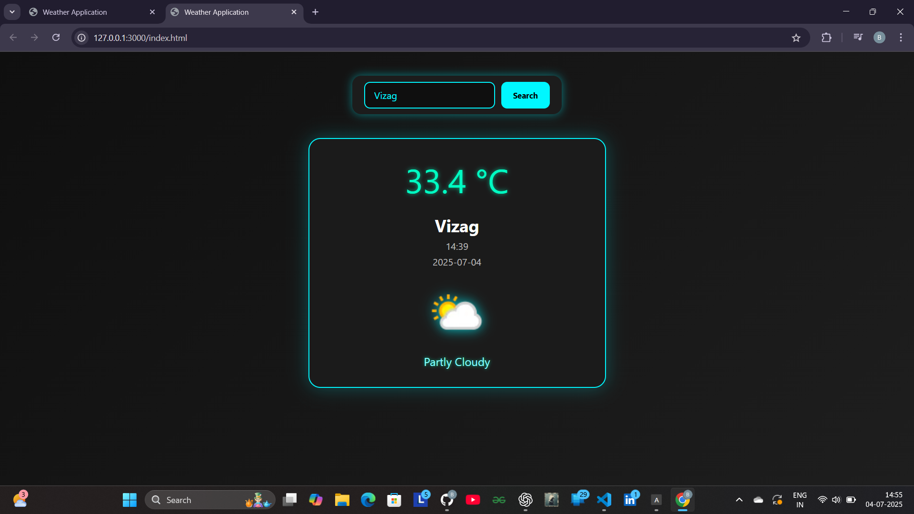

# 🌦️ Weather App

A simple weather application built using **HTML**, **CSS**, and **JavaScript**, powered by the **OpenWeatherMap API**.

## 🔥 Features
- Real-time weather search by city
- Displays temperature, humidity, wind speed, and conditions
- Clean and responsive design

## 🛠️ Technologies Used
- HTML, CSS, JavaScript
- Fetch API for HTTP requests
- OpenWeatherMap API

## 🚀 Live Demo
👉 [Click here to view the project](https://balavardhan01.github.io/Simple-Weather-Application/)

## 📷 Screenshot

## 📌 How to Run
1. Clone the repository
2. Open `index.html` in any browser
3. Start searching for city weather

## 📬 Feedback
If you have any suggestions or ideas to improve this project, feel free to open an issue or reach out!

---

